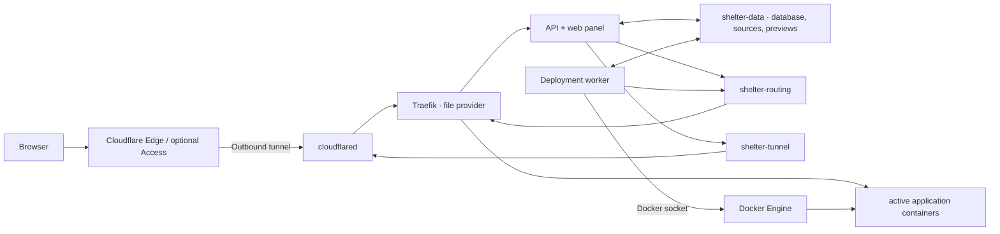

<div align="center">
  
  <h1>Shelter</h1>
  <p><strong>give your code a home</strong></p>
  <p>
    A small, self-hosted deployment platform for Git repositories,<br />
    ZIP archives, and project folders on your own VPS.
  </p>
  <p>
    <a href="https://shelter.host">Website</a>
    · <a href="#quick-start">Quick start</a>
    · <a href="docs/API.md">API & CLI</a>
    · <a href="#architecture">Architecture</a>
    · <a href="CONTRIBUTING.md">Contributing</a>
    · <a href="SECURITY.md">Security</a>
  </p>
  <p>
    
    
    
    
    
    <a href="LICENSE"></a>
  </p>
</div>

---

Shelter turns one VPS into a focused deployment control plane. Connect GitHub, use a public HTTPS Git source, or upload a project directly. Shelter builds a container image, checks the candidate, and only then switches production traffic. Domains and the administrator panel are published through a managed Cloudflare Tunnel, so project containers need no public host ports.

The product and marketing site live at [shelter.host](https://shelter.host). Every installation intentionally uses its own domain for the control panel.

> [!IMPORTANT]
> Shelter is currently a single-operator MVP for **trusted application code**. Docker builds are not a sandbox for hostile tenants. Read the [threat model](SECURITY.md#threat-model) before using Shelter in production.

## Why Shelter

| Deploy | Route | Control |
| --- | --- | --- |
| GitHub, HTTPS Git, ZIP, or local folder | Cloudflare Tunnel, DNS, and Traefik from one panel | Your VPS, data, and credentials |
| Next.js, React, Astro, Node.js, static sites, and file storage | Multiple hostnames per project | SQLite, encrypted secrets, and portable backups |
| Candidate health check before switching | No public application ports | Project CRUD, live logs, redeploys, and rollbacks |

### Highlights

- **Git-native:** private and public GitHub repositories through a minimally scoped GitHub App, with optional push-to-deploy and manual redeploy.
- **Upload-friendly:** ZIP files and complete folders are uploaded in chunks, validated, and versioned.
- **Useful defaults:** live source analysis for Next.js, React, Astro, Node.js, Vite, static exports, and safe file collections, with custom Dockerfile support when needed.
- **Safe activation:** a candidate container must pass its health check before Traefik receives the new route.
- **Cloudflare integration:** OAuth, tunnels, zones, DNS, hostname availability, apex domains, and multiple project domains in one place.
- **Instant context:** successful website deployments receive an automatic screenshot preview in the project overview.
- **Operator-ready:** dashboard, live deployment logs, rollbacks, project deletion, encrypted variables, and resource limits.
- **Automation-ready:** scoped, expiring personal access tokens, a documented HTTP API, OpenAPI, and an installable `shelter` CLI.
- **Multilingual panel:** English and German with browser detection and a persistent language preference.

## Quick start

### Requirements

- Ubuntu Server 24.04 or 26.04 LTS
- Docker Engine with Buildx and Docker Compose v2
- `openssl`
- a Cloudflare account with at least one active zone
- recommended: 2 vCPU, 4 GB RAM, and 40 GB SSD

```sh
git clone https://github.com/YOUR-ACCOUNT/shelter.git
cd shelter
chmod +x install.sh
./install.sh
```

The installer creates local runtime configuration, securely asks for the initial administrator email and password, builds the stack, and waits for a healthy API. For the first sign-in, open an SSH tunnel:

```sh
ssh -N -L 7080:127.0.0.1:7080 USER@YOUR-VPS
```

Open `http://127.0.0.1:7080`. Connect Cloudflare from Settings before publishing the panel or projects.

## API and CLI

Create a scoped token under **Settings → API & CLI**, then connect the bundled command-line client without placing the secret in shell history:

```sh
npm run build --workspace @shelter/cli
npm install --global ./apps/cli
shelter login --server https://panel.example.com
shelter projects
```

Each installation publishes its OpenAPI document at `/api/openapi.json`. See the [API guide](docs/API.md) and [CLI reference](apps/cli/README.md) for authentication, scopes, commands, uploads, JSON output, and CI usage.

## Architecture



| Component | Responsibility | Docker socket |
| --- | --- | --- |
| `api` | Authentication, panel, projects, uploads, domains, and Cloudflare API | No |
| `worker` | Prepare source, deploy applications, and collect bounded server metrics | Yes |
| `traefik` | Host-based HTTP routing from `/routing/dynamic.yml` | No |
| `cloudflared` | Outbound connection to the remotely managed tunnel | No |

API and worker share a WAL-enabled SQLite database in `shelter-data`. Persistent state is separated by purpose:

- `shelter-data`: database, uploaded source, temporary workspaces, and website previews,
- `shelter-routing`: generated Traefik configuration,
- `shelter-tunnel`: Cloudflare connector token.

Only the worker mounts `/var/run/docker.sock`. Traefik uses its file provider and also needs no socket. TLS terminates at Cloudflare Edge. The panel remains available on `127.0.0.1:${PANEL_PORT}` for bootstrap and emergency access through SSH.

The worker samples host capacity and managed-container aggregates every 15 seconds. It stores at most the configured retention window in SQLite; Docker stats are limited to Shelter-labelled containers and refreshed no more than once per minute. The session-only metrics endpoint never receives the Docker socket.

## Installation

Run from the Shelter directory on the VPS:

```sh
chmod +x install.sh
./install.sh
```

The installer:

1. checks Docker, Docker Compose v2, and OpenSSL,
2. creates `.env`, the administrator identity, and a random `APP_SECRET`,
3. pulls Traefik and `cloudflared` and builds API and worker images,
4. asks for an initial password of at least 16 characters,
5. waits for a healthy API, removes the bootstrap password atomically, recreates the API without it, and starts the complete stack.

An existing `.env` is reused. The file is always restricted to mode `0600`, and an interrupted installation can be safely run again.

```sh
docker compose ps
curl --fail http://127.0.0.1:7080/api/healthz
```

The health response also reports whether the deployment worker is online.

### First sign-in over SSH

```sh
ssh -N -L 7080:127.0.0.1:7080 USER@YOUR-VPS
```

Then open `http://127.0.0.1:7080`. If local port 7080 is occupied, use `-L 7081:127.0.0.1:7080` and open port 7081 instead.

## Connect Cloudflare

Shelter supports Cloudflare self-managed OAuth using the Authorization Code flow, refresh tokens, PKCE `S256`, and confidential-client token exchange with `client_secret_basic`. The browser never receives the client secret or access and refresh tokens.

### Create one private OAuth client

Create a private self-managed OAuth client for this Shelter installation in Cloudflare and select:

- **Response type:** `code`
- **Grant types:** `authorization_code` and `refresh_token`
- **Token authentication method:** `client_secret_basic`

Register the exact, stable callback URL, including scheme, host, port, and path, with no trailing slash:

```text
https://panel.example.com/api/settings/cloudflare/oauth/callback
```

Add the credentials to `.env`:

```dotenv
CLOUDFLARE_OAUTH_CLIENT_ID=...
CLOUDFLARE_OAUTH_CLIENT_SECRET=...
CLOUDFLARE_OAUTH_REDIRECT_URI=https://panel.example.com/api/settings/cloudflare/oauth/callback
CLOUDFLARE_OAUTH_SCOPES=account-settings.read zone.read dns.write argotunnel.write
```

Optional settings:

```dotenv
# OAuth token exchange and revocation only
CLOUDFLARE_OAUTH_PROXY_URL=http://proxy.internal:3128
```

The default scope IDs cover Account Read, Zone Read, DNS Write, and Cloudflare Tunnel Write. Restrict access to the one account and only the zones Shelter needs. Recreate the API after changing OAuth variables:

```sh
docker compose up -d --force-recreate api
```

### Finish setup in Shelter

1. Open Shelter from the registered callback origin and sign in.
2. Go to **Settings → Cloudflare Tunnel** and choose **Connect Cloudflare**.
3. Review and approve the requested permissions.
4. Select the intended account if Cloudflare returns more than one.
5. Enter a dedicated tunnel name such as `shelter-vps` and an unused panel domain such as `panel.example.com`.
6. Save and run the connection test.

For temporary bootstrap, a loopback callback such as `http://127.0.0.1:7081/api/settings/cloudflare/oauth/callback` may be used with an active SSH forward. Move both Cloudflare and `.env` to a stable HTTPS callback afterward.

Shelter creates a dedicated remotely managed tunnel with a catch-all origin of `http://traefik:80` and a proxied CNAME to `<tunnel-id>.cfargotunnel.com`. It refuses to take over an unrelated tunnel with the same name or overwrite a conflicting DNS record.

Access and refresh tokens are encrypted under `APP_SECRET`. Disconnecting Cloudflare revokes the management connection and removes credentials from Shelter. The connector intentionally remains online until its tunnel or connector token is separately rotated or deleted.

### API-token fallback

If OAuth is unavailable, create a narrowly scoped Cloudflare API token with the same four permissions. Enter the account ID and token in the panel or set `CLOUDFLARE_ACCOUNT_ID` and `CLOUDFLARE_API_TOKEN` in `.env`. Shelter cannot revoke a token loaded from the environment.

### Cloudflare Access

Shelter does not configure Cloudflare Access automatically. For a public production panel, create an Access application and restrictive policy for the panel domain in Cloudflare Zero Trust. Shelter authentication remains the second layer.

## Deploy projects

Create a project and choose a source.

### GitHub repository

Register Shelter's private GitHub App from **Settings → GitHub**, install it only on the repositories it should access, then select a repository and branch when creating a project.

Per project, choose whether push-to-deploy is enabled:

- **Auto-deploy on:** a signed GitHub push webhook queues a deployment for the selected branch.
- **Auto-deploy off:** the connection remains available, but pushes do not deploy.

**Deploy current source** always fetches the latest branch HEAD and creates a new deployment. Installation and webhook state are checked server-side. Private clones use short-lived, repository-scoped installation tokens.

### HTTPS Git

Provide a public HTTPS repository URL and branch. Embedded credentials, custom ports, URL queries and fragments, local paths, SSH URLs, and interactive Git authentication are rejected.

Public URL sources are analyzed after the worker has cloned the repository. Use the GitHub App repository picker when framework and monorepo detection should be visible before the project is created.

### ZIP or folder

Upload a ZIP archive or select a folder in the browser. Folder uploads are compressed locally and sent in chunks with progress feedback. Archives are validated against path traversal, absolute paths, links, device files, excessive expanded size, and suspicious compression ratios.

Shelter analyzes the selected ZIP or folder before the upload starts. Only safe relative paths and a small allowlist of project manifests are inspected; generated trees such as `node_modules`, `.next`, `dist`, and `build` are ignored. Real `.env` contents are never read. When a later upload appears to target a different app, root, runtime, or port, Shelter warns without silently changing the saved project settings.

If an upload contains only safe public assets such as images, media, or documents and no application entry point, Shelter publishes it as file storage. Original paths are preserved, directory browsing and dotfiles stay private, and unknown paths return `404` instead of an SPA fallback.

An upload project keeps its most recently accepted source archive. Use **Upload new source** from the project to replace it and trigger a new deployment without creating another project.

### Build detection

With **Detect automatically**, Shelter recognizes common projects from their files:

| Project | Typical signal | Runtime |
| --- | --- | --- |
| Next.js | `next` dependency | Node server or supported static output |
| React | Vite or Create React App dependencies | Static SPA with history fallback |
| Astro | Astro dependency and output configuration | Static multi-page output or supported Node server |
| Node.js | `package.json` with start/build scripts | Node server |
| Vite | Vite dependency or config | Static output |
| Static site/export | HTML files or known output directory | Static web server |
| File storage | Safe asset-only ZIP or folder upload without an app entry point | Direct static files with private directory listings |
| Custom | `Dockerfile` | User-defined image |

GitHub repositories are analyzed as soon as a repository and branch are selected. In a monorepo, Shelter lists the detected applications and applies the chosen root and preset only to fields that have not already been edited manually. Analysis is advisory and is validated again from the checked-out source before each build.

For npm, pnpm, Yarn, and Bun workspaces, generated builds keep the repository root as their build context, install from the workspace lockfile, and run the selected application from its own directory. Literal, safe Vite `build.outDir` and Astro `outDir` values are respected. Astro server output is started automatically only when the configuration uses `@astrojs/node` in standalone mode; other adapters require a project Dockerfile.

The project root, build type, Dockerfile path, application port, and health-check path can be overridden in project settings. For static exports mounted below `/`, select the application base path explicitly so assets and SPA fallback routing remain correct.

### Environment variables

Variables are encrypted under `APP_SECRET` at rest. Saved values are not returned to the browser. The worker supplies them to automatic builds using a BuildKit secret and to running containers as environment variables.

File-storage runtimes never receive project environment variables because they do not execute application code.

`NEXT_PUBLIC_*` and similar variables are public by design and must not contain secrets. Trusted build code can still print or persist any value it receives; see [SECURITY.md](SECURITY.md#project-variables).

### Domains

Project domains are selected from active zones in the connected Cloudflare account. Both apex domains such as `example.com` and subdomains such as `app.example.com` are supported.

Before creating a record, Shelter checks:

- hostname validity,
- the authoritative active zone,
- whether the panel reserves the hostname,
- whether another Shelter project already owns it,
- whether Cloudflare already contains a conflicting DNS record.

Each domain is routed through the same Cloudflare Tunnel to Traefik. A domain needs an active deployment before it can serve an application.

## Project lifecycle

- **Edit settings:** source routing, build type, paths, port, health check, and auto-deploy.
- **Replace source:** upload a new ZIP or folder for upload-backed projects.
- **Redeploy:** fetch the latest configured Git branch or rebuild the current uploaded source.
- **Rollback:** reactivate a previously successful deployment.
- **Delete project:** remove routes, project containers and images, stored source, previews, deployments, and owned DNS associations after confirmation.

Each deployment runs in a version-bound container. The current runtime stays online while its candidate is built and health-checked; Shelter then changes the persisted active deployment and Traefik routing atomically, and removes the previous runtime only after the switch commits. A failed candidate or routing update keeps or restores the previous deployment. Deployment logs are streamed in the panel.

## Configuration

Start from `.env.example`. The most commonly changed settings are:

| Variable | Default | Purpose |
| --- | --- | --- |
| `ADMIN_EMAIL` | required | Initial administrator identity |
| `APP_SECRET` | required | Encryption key; never rotate without migration |
| `PANEL_PORT` | `7080` | Loopback host port for bootstrap access |
| `MAX_UPLOAD_MB` | `500` | Maximum compressed upload size |
| `DEPLOYMENT_MEMORY` | `1g` | Default application-container memory limit |
| `DEPLOYMENT_CPUS` | `1.0` | Default application-container CPU limit |
| `HEALTHCHECK_TIMEOUT_SECONDS` | `60` | Candidate health-check window |
| `BUILD_TIMEOUT_MINUTES` | `30` | Docker build timeout |
| `GIT_TIMEOUT_MINUTES` | `10` | Git clone timeout |
| `BUILD_CACHE_MAX_GB` | `8` | Daemon-wide builder-cache target after deployments |
| `METRICS_INTERVAL_SECONDS` | `15` | Server-metrics sample interval |
| `METRICS_RETENTION_HOURS` | `48` | Raw server-metrics retention window |
| `SESSION_TTL_HOURS` | `24` | Administrator session lifetime |
| `LOG_LEVEL` | `info` | API and worker log level |
| `CLOUDFLARE_ACCOUNT_ID` | empty | Optional API-token fallback account |
| `CLOUDFLARE_API_TOKEN` | empty | Optional API-token fallback credential |
| `CLOUDFLARE_OAUTH_*` | empty | Private OAuth-client configuration |
| `DOCKER_SOCKET` | `/var/run/docker.sock` | Optional host socket path |

The control subnet and fixed service IPs are also configurable. If the default `10.253.253.0/24` overlaps a VPS, VPN, or cloud network, change `CONTROL_SUBNET` and all four `*_CONTROL_IP` values together.

Apply supported `.env` changes with:

```sh
docker compose up -d --force-recreate
```

Do not change `APP_SECRET` without a data migration. Existing Cloudflare tokens, GitHub App credentials, webhook secrets, and project variables otherwise become unreadable. Setting bootstrap password variables after the administrator exists does not change the password; use the panel.

## Backup and restore

A complete backup must keep these items together:

- `.env`, especially the unchanged `APP_SECRET`,
- the volume mounted at `/data`,
- the volume mounted at `/routing`,
- the volume mounted at `/tunnel`.

Together they contain control-plane credentials, source archives, project variables, previews, routes, and the connector token. Encrypt backups, restrict access, define retention, and test restores on an isolated host.

### Consistent backup

Run only when no deployment is active:

```sh
docker pull alpine:3.22
STAMP="$(date -u +%Y%m%dT%H%M%SZ)"
BACKUP_DIR="$PWD/backups/$STAMP"
install -d -m 700 "$BACKUP_DIR"
install -m 600 .env "$BACKUP_DIR/.env"

API_CONTAINER="$(docker compose ps -q api)"
test -n "$API_CONTAINER"
DATA_VOLUME="$(docker inspect --format '{{range .Mounts}}{{if eq .Destination "/data"}}{{.Name}}{{end}}{{end}}' "$API_CONTAINER")"
ROUTING_VOLUME="$(docker inspect --format '{{range .Mounts}}{{if eq .Destination "/routing"}}{{.Name}}{{end}}{{end}}' "$API_CONTAINER")"
TUNNEL_VOLUME="$(docker inspect --format '{{range .Mounts}}{{if eq .Destination "/tunnel"}}{{.Name}}{{end}}{{end}}' "$API_CONTAINER")"

docker compose stop -t 60 worker api
trap 'docker compose start api worker >/dev/null 2>&1 || true' EXIT INT TERM
docker run --rm \
  -v "$DATA_VOLUME":/source/data:ro \
  -v "$ROUTING_VOLUME":/source/routing:ro \
  -v "$TUNNEL_VOLUME":/source/tunnel:ro \
  -v "$BACKUP_DIR":/backup \
  alpine:3.22 sh -ec '
    tar -czf /backup/shelter-data.tar.gz -C /source/data .
    tar -czf /backup/shelter-routing.tar.gz -C /source/routing .
    tar -czf /backup/shelter-tunnel.tar.gz -C /source/tunnel .
    chmod 600 /backup/shelter-*.tar.gz
  '
docker compose start api worker
trap - EXIT INT TERM
```

Verify every archive with `tar -tzf`. The API and worker pause briefly; project containers, Traefik, and the tunnel can keep running. Application images are not part of the volume backup and should be rebuilt through redeploy after a host restore.

### Restore

Use the same Shelter version or a compatible newer version. Save the current state first, restore the matching `.env` and all three archives into their mounted volumes, then start the stack:

```sh
docker compose pull traefik cloudflared
docker compose build api worker
docker compose up -d
curl --fail http://127.0.0.1:7080/api/healthz
```

Redeploy every project on a new VPS so application images and stable containers are recreated.

## Update

Create a backup first:

```sh
git pull --ff-only
docker compose pull traefik cloudflared
docker compose build --pull api worker
docker compose up -d
docker compose ps
curl --fail http://127.0.0.1:7080/api/healthz
```

`./install.sh` may also be run again and reuses the existing `.env`. The MVP has no automatic control-plane rollback, so record the previous release or commit and keep its backup.

### Portsmith migration

The first Shelter deployment detects an existing Portsmith installation, preserves its runtime `.env`, explicitly reuses its three Docker volumes, creates a consistent SQLite backup, and starts the control plane under the Compose project name `shelter`. Keep the existing `APP_SECRET` unchanged.

Legacy internal resource names such as `portsmith-data`, `portsmith-routing`, `portsmith-tunnel`, `portsmith-runtime`, and `portsmith-app-*` may remain until each resource is safely replaced. They are not a visible product name and must not be renamed blindly, because attaching a new empty volume can appear as complete data loss.

### Deploy from a development machine

Server access belongs in the separate, ignored `.env.server`, never in the runtime `.env`:

```sh
cp .env.server.example .env.server
chmod 600 .env.server
# Fill in .env.server; prefer SHELTER_SERVER_IDENTITY_FILE.
./ops/deploy.sh --dry-run
./ops/deploy.sh
```

The helper refuses group- or world-readable configuration, verifies the SSH host key with `accept-new`, syncs with rsync, and starts Compose on the VPS. Runtime `.env` and persistent data are preserved. Password fallback uses a temporary `SSH_ASKPASS` helper, but an SSH key remains the recommended permanent setup.

## Security

- Build only repositories and archives you fully trust.
- Treat administrator access as root access to the VPS.
- Put Cloudflare Access in front of the panel.
- Allow inbound SSH only. Shelter needs no public ports 80, 443, or 7080.
- Prefer SSH keys, restrict root login, and update the host, Docker Engine, and images regularly.
- Never share `.env`, volume backups, Cloudflare credentials, or unredacted deployment logs.

The worker's Docker socket is effectively host-root access. API, Traefik, `cloudflared`, and project containers do not receive it. This reduces attack surface but does not create safe hostile multi-tenancy. Read [SECURITY.md](SECURITY.md) for the full threat model and secret handling rules.

## Troubleshooting

### Overall status and logs

```sh
docker compose ps
docker compose logs --tail=200 api worker traefik cloudflared
curl -sS http://127.0.0.1:7080/api/healthz
docker system df
```

### Panel is not reachable locally

- Confirm that `api` is healthy.
- Confirm that the SSH tunnel is running and forwards to the correct local port.
- Check `PANEL_PORT` in `.env`.
- Remember that the host port intentionally binds to `127.0.0.1` only.

### Worker is offline

```sh
docker compose logs --tail=200 worker
docker compose exec worker docker version
ls -l /var/run/docker.sock
```

If the host uses another socket path, set `DOCKER_SOCKET` and recreate the worker.

### Build or health check fails

- Inspect deployment logs in the project.
- Check Git URL, branch, and reachability from the VPS.
- For a custom Dockerfile, listen on `0.0.0.0:<project-port>`.
- Return 2xx or 3xx from the health-check path within the timeout.
- Check `docker system df` and `df -h`.
- Redact secrets before sharing any application logs.

### Tunnel or domain fails

```sh
docker compose logs --tail=200 cloudflared traefik
docker compose exec api cat /routing/dynamic.yml
```

Check the OAuth connection and scopes, exact callback URL, active zone under the connected account, DNS collision status, panel connection test, active project deployment, and outbound TCP/UDP 7844. An `active` DNS record alone does not mean an application container exists.

### ZIP is rejected

- Check compressed size against `MAX_UPLOAD_MB`.
- Remove absolute paths, `..`, symlinks, and device files.
- Avoid deeply nested or extremely compressed archives.
- For folder uploads, check browser memory and local free space.

## Development

Node.js 24 and npm 11 are required:

```sh
npm ci
npm run dev
npm run check
```

`npm run check` runs strict type checking, all server, web, and CLI tests, and all three production builds. Local automated tests use temporary data and do not modify real Cloudflare, GitHub, or Docker resources.

A real end-to-end smoke test requires a disposable VPS, an active Cloudflare zone and free test hostnames, a private Cloudflare OAuth client or scoped API token, a test repository or ZIP, and explicit permission to modify those resources.

## Current MVP limitations

- one VPS only; no cluster, replication, or high availability,
- local SQLite database and no distributed queue,
- no hostile multi-tenancy or sandbox for untrusted Docker builds,
- daemon-wide builder-cache cleanup,
- GitHub App support for private repositories, but no other private Git providers, SSH keys, or deploy tokens,
- no pull-request preview deployments or branch-per-environment model,
- no Shelter-managed persistent application volumes or database services,
- HTTP applications only; no TCP or UDP proxying,
- domains must be active zones in the connected Cloudflare account,
- no Cloudflare for SaaS custom hostnames for customer-owned accounts,
- deployment switches avoid planned downtime, but a VPS, Docker daemon, Traefik, or storage failure can still interrupt service because there is no multi-node high availability,
- one administrator and no user management,
- no integrated backup or control-plane update workflow in the panel.

## Community

Contributions are welcome. Read [CONTRIBUTING.md](CONTRIBUTING.md) before opening a pull request and [AGENTS.md](AGENTS.md) for automated changes. Use [SUPPORT.md](SUPPORT.md) for support guidance and [CODE_OF_CONDUCT.md](CODE_OF_CONDUCT.md) for community expectations. Report vulnerabilities privately according to [SECURITY.md](SECURITY.md).

Never include secrets, complete environment files, or unredacted production logs in issues or pull requests.

## License

Shelter is free and open-source software licensed under the [GNU Affero General Public License Version 3](LICENSE), version 3 only (`AGPL-3.0-only`). You may use, study, modify, and distribute Shelter. If you make a modified version available to others over a network, section 13 requires offering those users the complete corresponding source code.

Copyright © 2026 Shelter contributors.
