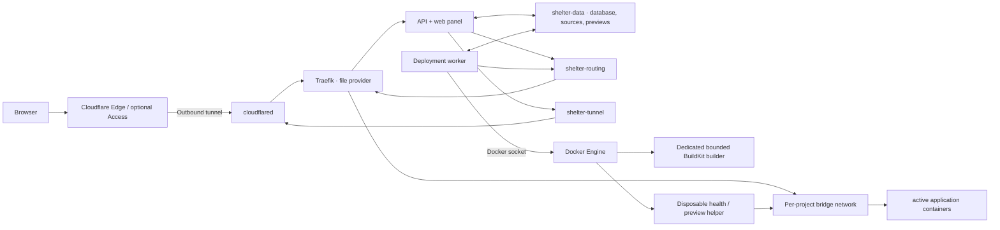

<div align="center">
  
  <h1>Shelter</h1>
  <p><strong>give your code a home</strong></p>
  <p>
    Open-source deployment infrastructure for people who want<br />
    the simplicity of a platform and the ownership of their own VPS.
  </p>
  <p>
    Built by <a href="https://raum.so"><strong>raum</strong></a>.
  </p>
  <p>
    <a href="https://shelter.host">Website</a>
    · <a href="#quick-start">Quick start</a>
    · <a href="docs/API.md">API & CLI</a>
    · <a href="docs/RELEASES.md">Releases</a>
    · <a href="#architecture">Architecture</a>
    · <a href="CONTRIBUTING.md">Contributing</a>
    · <a href="SECURITY.md">Security</a>
  </p>
  <p>
    <a href="https://github.com/asteinberger/shelter/actions/workflows/ci.yml?query=branch%3Adev"></a>
    
    
    
    
    
    <a href="LICENSE"></a>
  </p>
</div>

---

Shelter turns one VPS into a deployment platform you own. Connect GitHub, use a public HTTPS Git source, or upload a project directly. Shelter builds a container image, checks the candidate, and only then switches production traffic. Domains and the administrator panel are published through a managed Cloudflare Tunnel, so project containers need no public host ports.

It is built on a simple belief: owning your infrastructure should not mean operating every deployment by hand.

The product and marketing site live at [shelter.host](https://shelter.host). Every installation intentionally uses its own domain for the control panel.

> [!IMPORTANT]
> Shelter is currently a single-operator MVP for **trusted application code**. Docker builds are not a sandbox for hostile tenants. Read the [threat model](SECURITY.md#threat-model) before using Shelter in production.

## Why Shelter

Most deployment platforms trade ownership for convenience. Traditional self-hosting often trades convenience for ownership. Shelter is built for the middle: platform-style workflows on infrastructure you control.

| Deploy | Route | Control |
| --- | --- | --- |
| GitHub, HTTPS Git, ZIP, or local folder | Cloudflare Tunnel, DNS, and Traefik from one panel | Your VPS, data, and credentials |
| Next.js, React, Astro, Node.js, static sites, and file storage | Multiple hostnames per project | SQLite, encrypted secrets, and portable backups |
| Candidate health check before switching | No public application ports | Project CRUD, live logs, redeploys, and rollbacks |

### Highlights

- **Git-native:** private and public GitHub repositories through a minimally scoped GitHub App, with optional push-to-deploy and manual redeploy.
- **Upload-friendly:** ZIP files and complete folders are uploaded in chunks, validated, and versioned.
- **Useful defaults:** live source analysis for Next.js, React, Astro, Node.js, Vite, static exports, and safe file collections, with custom Dockerfile support when needed.
- **Safe activation:** a disposable, resource-bounded helper probes each candidate on its project-only network before Traefik receives the new route.
- **Cloudflare integration:** OAuth, tunnels, zones, DNS, hostname availability, apex domains, and multiple project domains in one place.
- **Instant context:** successful website deployments receive an automatic screenshot preview in the project overview.
- **Operator-ready:** dashboard, deployment logs, rollbacks, project deletion, encrypted variables, resource limits, and per-project runtime observability.
- **Automation-ready:** scoped, expiring personal access tokens, a documented HTTP API, OpenAPI, and an installable `shelter` CLI.
- **Verifiable releases:** immutable GitHub Releases, digest-pinned multi-platform images, signed provenance, downloadable SBOMs, and a fail-closed release installer.
- **Multilingual panel:** English and German with browser detection and a persistent language preference.

## Quick start

- Ubuntu Server 24.04 or 26.04 LTS
- Docker Engine with Buildx and Docker Compose v2
- `openssl`
- recommended: 2 vCPU, 4 GB RAM, and 40 GB SSD

```sh
git clone https://github.com/asteinberger/shelter.git
cd shelter
./install.sh doctor
./install.sh
```

The installer checks the VPS, asks for the initial administrator and local panel port, builds Shelter, and verifies the complete control plane. From your computer, open the SSH tunnel printed at the end:

```sh
ssh -N -L 7080:127.0.0.1:7080 USER@YOUR-VPS
```

Open `http://127.0.0.1:7080`, sign in, and then [connect Cloudflare](#connect-cloudflare) to publish the panel and projects. A Cloudflare account and active zone are needed for publishing, not for the local installation.

The commands above deliberately build a reviewed checkout locally. Production
operators should prefer a [verified release bundle](docs/RELEASES.md), which
installs the signed control-plane image by digest without rebuilding it on the
VPS.

## API and CLI

Create a scoped token under **Settings → API & CLI**, then install the standalone [Shelter CLI](https://github.com/asteinberger/shelter-cli) without placing the secret in shell history:

```sh
git clone https://github.com/asteinberger/shelter-cli.git
cd shelter-cli
npm ci
npm run build
npm install --global .
shelter login --server https://panel.example.com
shelter projects
```

Each installation publishes its OpenAPI document at `/api/openapi.json`. See the [API guide](docs/API.md) and [CLI repository](https://github.com/asteinberger/shelter-cli) for authentication, scopes, commands, uploads, JSON output, and CI usage.

## Architecture



| Component | Responsibility | Docker socket |
| --- | --- | --- |
| `api` | Authentication, panel, projects, uploads, domains, and Cloudflare API | No |
| `worker` | Prepare source, deploy applications, and collect bounded server metrics | Yes |
| `traefik` | Host-based HTTP routing from `/routing/dynamic.yml` | No |
| `cloudflared` | Outbound connection to the remotely managed tunnel | No |

API and worker share a WAL-enabled SQLite database in `shelter-data`. Persistent state is separated by purpose:

- `shelter-data`: database, uploaded source, temporary workspaces, and website previews,
- `shelter-routing`: generated Traefik configuration,
- `shelter-tunnel`: Cloudflare connector token.

Only the worker mounts `/var/run/docker.sock`. The worker stays on the control network and is not attached to application networks. Every project receives its own managed bridge network containing only that project's runtime generation, short-lived helpers when needed, and the current Shelter Traefik generation; projects cannot address one another through a shared Shelter runtime network. Traefik uses its file provider and needs no socket. TLS terminates at Cloudflare Edge. The panel remains available on `127.0.0.1:${PANEL_PORT}` for bootstrap and emergency access through SSH.

Candidate health probes and screenshot captures run in disposable containers on the matching project network. They have no Docker socket or host bind mount, use a read-only root filesystem, drop all capabilities, enforce memory/CPU/PID/time bounds, and are ownership-checked before removal. Builds use Shelter's dedicated Docker-container BuildKit builder with independently configured memory, swap, CPU, PID, and maximum-parallelism bounds plus a builder-cache GC target. A continuously sampled free-space guard cancels cancellable source/build work and refuses completion when the data filesystem falls below `BUILD_MIN_FREE_GB`.

The worker samples host capacity, managed-container aggregates, and each active project's production runtime at the configured metrics interval (15 seconds by default). It stores at most the configured retention window in SQLite; Docker inspection is restricted to Shelter-owned containers whose project and active-deployment labels match database state. Host and project observability endpoints are administrator-session-only and never receive the Docker socket.

Runtime output is collected by the worker on that same interval, separately from immutable build/deployment logs. Shelter keeps at most 5,000 runtime lines per project and serves at most 500 lines at a time for the active deployment. Exact configured environment-variable values are redacted before persistence, but applications can still emit derived, encoded, reformatted, or otherwise sensitive data. Treat runtime logs as sensitive administrator data and do not describe the interval-based view as instantaneous streaming.

## Installation

Run the installer from a trusted Shelter checkout on the VPS for a local source
build:

```sh
./install.sh
```

For a fresh installation it:

1. checks Linux, Docker, Compose v2, Buildx, required host tools, architecture, and available disk space,
2. asks for the administrator email, loopback panel port, and a confirmed password of at least 16 characters,
3. shows the installation plan before changing the system,
4. creates `.env` atomically with mode `0600` and a random `APP_SECRET`,
5. pulls the pinned runtime images, builds the control plane, and inspects persistent data before bootstrap,
6. creates the administrator with a one-time bootstrap credential, removes that value atomically, and restarts the API without it,
7. verifies the API, worker, and Traefik. Cloudflare may remain `not configured yet` until the next setup step.

The panel stays bound to `127.0.0.1`; the installer does not open a public host port. Run `./install.sh --help` for the complete command reference.

For production, follow the [release guide](docs/RELEASES.md) instead. The
release helper cryptographically verifies the immutable GitHub Release and its
downloaded asset before reading the archive, then installs the exact OCI digest
recorded in the checked bundle.

### Check the server with `doctor`

Run the doctor before installing, after an update, or when the panel is unavailable:

```sh
./install.sh doctor
```

It checks the host prerequisites and Docker daemon. When `.env` exists, it also validates required values and Compose configuration, reports Docker-socket and service state, and makes no configuration or container changes.

Use plain output in logs or terminals without color:

```sh
NO_COLOR=1 ./install.sh doctor
```

### Non-interactive installation

Provisioning systems can supply all fresh-install values explicitly. The password must be a single line of at least 16 characters from a protected file or secret-manager pipe:

```sh
./install.sh --non-interactive \
  --email admin@example.com \
  --panel-port 7080 \
  --password-stdin \
  < /run/secrets/shelter-admin-password
```

`--non-interactive` never prompts and implies `--yes`. Shelter intentionally has no password argument or password environment variable; do not place the password in shell history. Restrict the input file to the operator and delete it after moving the credential into a password manager.

For an existing healthy installation, a non-interactive repair or rebuild needs no identity arguments:

```sh
./install.sh --non-interactive
```

If a previous bootstrap is still pending and no bootstrap password remains in `.env`, add `--password-stdin` again. Existing administrator email and panel-port values cannot be changed through installer flags; use the panel for the account and edit the supported `.env` setting deliberately for the port.

### Useful installer options

| Option | Purpose |
| --- | --- |
| `doctor` | Run host, configuration, and service checks without rebuilding |
| `--email EMAIL` | Set the administrator email on a fresh installation |
| `--panel-port PORT` | Set the loopback panel port on a fresh installation |
| `--password-stdin` | Read the one-time administrator password from standard input |
| `--non-interactive` | Disable every prompt and imply `--yes` |
| `--yes` | Accept the displayed installation plan |
| `--verbose` | Stream full Docker output instead of compact progress |
| `--no-color` | Disable ANSI colors; `NO_COLOR` is also supported |
| `--no-pull` | Reuse known local images; intended for controlled offline recovery only |
| `--bootstrap-empty-volume` | Bootstrap an intentionally empty configured data volume |

The last option is deliberately explicit. Never use it merely to bypass a missing-data warning; first confirm that the configured volume is supposed to be empty.

### First sign-in over SSH

```sh
ssh -N -L 7080:127.0.0.1:7080 USER@YOUR-VPS
```

Then open `http://127.0.0.1:7080`. If local port 7080 is occupied, use `-L 7081:127.0.0.1:7080` and open `http://127.0.0.1:7081`. With a custom `PANEL_PORT`, use that value on the right-hand side; the installer prints the exact command.

## Connect Cloudflare

Cloudflare is the next step after the local panel is healthy; it is not required to finish `./install.sh`. Shelter supports Cloudflare self-managed OAuth using the Authorization Code flow, refresh tokens, PKCE `S256`, and confidential-client token exchange with `client_secret_basic`. The browser never receives the client secret or access and refresh tokens.

### Create one private OAuth client

Create a private self-managed OAuth client for this Shelter installation in Cloudflare and select:

- **Response type:** `code`
- **Grant types:** `authorization_code` and `refresh_token`
- **Token authentication method:** `client_secret_basic`

For the first connection over the SSH tunnel, register the exact browser URL, including scheme, local forwarding port, and path, with no trailing slash:

```text
http://127.0.0.1:7080/api/settings/cloudflare/oauth/callback
```

If the left-hand side of the SSH forward uses port 7081, the callback must use 7081 as well. If the final panel hostname is already reachable through a prepared tunnel, use its stable HTTPS callback directly:

```text
https://panel.example.com/api/settings/cloudflare/oauth/callback
```

Add the credentials to `.env`:

```dotenv
CLOUDFLARE_OAUTH_CLIENT_ID=...
CLOUDFLARE_OAUTH_CLIENT_SECRET=...
CLOUDFLARE_OAUTH_REDIRECT_URI=http://127.0.0.1:7080/api/settings/cloudflare/oauth/callback
CLOUDFLARE_OAUTH_SCOPES=account-settings.read zone.read dns.write argotunnel.write
```

Optional settings:

```dotenv
# OAuth token exchange and revocation only
CLOUDFLARE_OAUTH_PROXY_URL=http://proxy.internal:3128
```

The default scope IDs cover Account Read, Zone Read, DNS Write, and Cloudflare Tunnel Write. Restrict access to the one account and only the zones Shelter needs. Recreate the API after changing OAuth variables:

```sh
docker compose up -d --force-recreate api
```

### Finish setup in Shelter

1. Keep the SSH tunnel open and sign in from the exact origin registered above.
2. Go to **Settings → Cloudflare Tunnel** and choose **Connect Cloudflare**.
3. Review the requested permissions and select the intended account if Cloudflare returns more than one.
4. Enter a dedicated tunnel name such as `shelter-vps` and an unused panel hostname such as `panel.example.com`.
5. Save, run the connection test, and open the new HTTPS panel URL.
6. Replace the loopback callback in both the Cloudflare OAuth client and `.env` with `https://panel.example.com/api/settings/cloudflare/oauth/callback`.
7. Recreate the API with `docker compose up -d --force-recreate api`, sign in at the final HTTPS origin, and test **Connect Cloudflare** once more.
8. Put a restrictive Cloudflare Access policy in front of the panel, review the exact hostname, and save the hostname-bound administrator confirmation in Shelter before treating it as production-ready.

Shelter creates a dedicated remotely managed tunnel with a catch-all origin of `http://traefik:80` and a proxied CNAME to `<tunnel-id>.cfargotunnel.com`. It refuses to take over an unrelated tunnel with the same name or overwrite a conflicting DNS record.

Access and refresh tokens are encrypted under `APP_SECRET`. Disconnecting Cloudflare revokes the management connection and removes credentials from Shelter. The connector intentionally remains online until its tunnel or connector token is separately rotated or deleted.

### API-token fallback

If OAuth is unavailable, create a narrowly scoped Cloudflare API token with the same four permissions. Enter the account ID and token in the panel or set `CLOUDFLARE_ACCOUNT_ID` and `CLOUDFLARE_API_TOKEN` in `.env`. Shelter cannot revoke a token loaded from the environment.

### Cloudflare Access

Shelter does not configure or inspect Cloudflare Access policies automatically. For a public production panel, create an Access application and restrictive policy for the panel domain in Cloudflare Zero Trust, review the exact hostname, and then save the administrator confirmation under **Settings → Cloudflare**. The confirmation is bound to that hostname and is invalidated when the panel hostname changes. Until it exists, the dashboard and overview show a red **Production unsafe** status; deployments remain available. This is an operator acknowledgement, not automatic proof that the Cloudflare policy is correct. Shelter authentication remains the second layer.

## Deploy projects

Create a project and choose a source.

### GitHub repository

Register Shelter's private GitHub App from **Settings → GitHub**, install it only on the repositories it should access, then select a repository and branch when creating a project.

Per project, choose whether push-to-deploy is enabled:

- **Auto-deploy on:** a signed GitHub push webhook queues a deployment for the selected branch.
- **Auto-deploy off:** the connection remains available, but pushes do not deploy.

**Deploy current source** always fetches the latest branch HEAD and creates a new deployment. Installation and webhook state are checked server-side. Private clones use short-lived, repository-scoped installation tokens.

#### GitHub App upgrades

Newly registered Shelter GitHub Apps include every permission and webhook event required by the current Shelter version. When an older App is missing a required capability, Shelter can register a replacement through GitHub's App Manifest flow with the new permissions and events preselected. This creates a separate GitHub App; it does not modify the existing registration.

The replacement remains pending while it is registered, installed, and checked. Shelter keeps the current App credentials, project connections, auto-deploys, and production traffic active throughout that process. It switches to the replacement only after the candidate App and installation satisfy the required capability checks. Cancelling the flow or failing a check leaves the existing connection unchanged.

After Shelter reports that the replacement is active, remove the old App and its installation manually in GitHub. Shelter cannot delete a GitHub App registration on the operator's behalf. Do not remove the old App before the switch has completed.

As an alternative, an App owner can update the existing registration manually under **Permissions & events**, then have each affected installation owner approve the added permissions. GitHub does not provide an API for Shelter to change an existing App's requested permissions or event subscriptions automatically.

#### Pull-request preview deployments

GitHub App projects can explicitly opt into pull-request previews and select one active project domain as their Cloudflare zone source. Shelter publishes a successful preview at a single-label zone hostname such as `pr-42--my-app-ab12cd34.example.com`, reports every admitted or limit-blocked build through the `shelter/preview` commit status, and removes the bounded runtime, route, image, and exact owned DNS record when the pull request closes or its 1–168 hour TTL expires. During a rebuild or failed update, the last successful generation stays routed until a healthy replacement switches atomically.

Preview builds are deliberately fail-closed: the PR base branch must equal the project's configured branch, the head repository ID and full name must exactly equal the installed repository, and fork PRs are never built. A project can have at most three active previews. Synchronize events coalesce to the newest SHA and cooperatively cancel a running obsolete build. Preview variables live in a separate encrypted set and production variables are never inherited.

Pull-request previews require `Pull requests: Read-only` and the `pull_request` event. The separately cached `/api/settings/github/preview-capability?installationId=...` check distinguishes App configuration from installation approval without coupling local preview lifecycle polling to GitHub availability. Shelter refuses preview opt-in until both are ready instead of silently assuming that events will arrive.

### HTTPS Git

Provide a public HTTPS repository URL and branch. Embedded credentials, custom ports, URL queries and fragments, local paths, SSH URLs, and interactive Git authentication are rejected.

Public URL sources are analyzed after the worker has cloned the repository. Use the GitHub App repository picker when framework and monorepo detection should be visible before the project is created.

### ZIP or folder

Upload a ZIP archive or select a folder in the browser. Folder uploads are compressed locally and sent in chunks with progress feedback. Archives are validated against path traversal, absolute paths, links, device files, excessive expanded size, and suspicious compression ratios.

Shelter analyzes the selected ZIP or folder before the upload starts. Only safe relative paths, project manifests, explicit `.env.example`/`.env.sample` files, and a bounded set of supported text source files are inspected; generated trees such as `node_modules`, `.next`, `dist`, and `build` are ignored. Real `.env` contents are never read and repository code is never executed by the analyzer. When a later upload appears to target a different app, root, runtime, or port, Shelter warns without silently changing the saved project settings.

If an upload contains only safe public assets such as images, media, or documents and no application entry point, Shelter publishes it as file storage. Original paths are preserved, directory browsing and dotfiles stay private, and unknown paths return `404` instead of an SPA fallback.

An upload project keeps its most recently accepted source archive. Use **Upload new source** from the project to replace it and trigger a new deployment without creating another project.

### Build detection

With **Detect automatically**, Shelter recognizes common projects from their files:

| Project | Typical signal | Runtime |
| --- | --- | --- |
| Next.js | `next` dependency | Node server or supported static output |
| React | Vite or Create React App dependencies | Static SPA with history fallback |
| Astro | Astro dependency and output configuration | Static multi-page output or supported Node server |
| Node.js | `package.json` with start/build scripts | Node server |
| Vite | Vite dependency or config | Static output |
| Static site/export | HTML files or known output directory | Static web server |
| File storage | Safe asset-only ZIP or folder upload without an app entry point | Direct static files with private directory listings |
| Custom | `Dockerfile` | User-defined image |

GitHub repositories are analyzed as soon as a repository and branch are selected. In a monorepo, Shelter lists the detected applications and applies the chosen root and preset only to fields that have not already been edited manually. Analysis is advisory and is validated again from the checked-out source before each build.

For npm, pnpm, Yarn, and Bun workspaces, generated builds keep the repository root as their build context, install from the workspace lockfile, and run the selected application from its own directory. Literal, safe Vite `build.outDir` and Astro `outDir` values are respected. Astro server output is started automatically only when the configuration uses `@astrojs/node` in standalone mode; other adapters require a project Dockerfile.

The project root, build type, Dockerfile path, application port, and health-check path can be overridden in project settings. For static exports mounted below `/`, select the application base path explicitly so assets and SPA fallback routing remain correct.

### Environment variables

Variables are encrypted under `APP_SECRET` at rest. Saved values are not returned to the browser. The worker supplies them to automatic builds using a BuildKit secret and to running containers as environment variables.

During GitHub, ZIP, and folder setup, Shelter detects bounded static references such as `process.env.KEY`, `import.meta.env.KEY`, Deno/Bun environment access, explicit example files, and common Zod/`createEnv` declarations. The setup separates required values from suggestions, server-only secrets from public client variables, and build-time from runtime use. High-confidence required values are requested before the first deployment, every finding links back to its source path and line, and a suspected false positive can be explicitly skipped. Dynamic lookups remain advisory and may need to be added manually.

Builds run through Shelter's dedicated `docker-container` BuildKit builder rather than the unbounded default builder. The builder enforces configured memory, swap, CPU, PID, and maximum-parallelism limits and applies a cache-GC target; supported Buildx versions also receive the same per-build resource limits. Shelter checks free space throughout source preparation and the build, cancels cancellable work, and refuses completion below `BUILD_MIN_FREE_GB`.

File-storage runtimes never receive project environment variables because they do not execute application code.

`NEXT_PUBLIC_*` and similar variables are public by design and must not contain secrets. Trusted build code can still print or persist any value it receives; see [SECURITY.md](SECURITY.md#project-variables).

### Domains

Project domains are selected from active zones in the connected Cloudflare account. Both apex domains such as `example.com` and subdomains such as `app.example.com` are supported.

Before creating a record, Shelter checks:

- hostname validity,
- the authoritative active zone,
- whether the panel reserves the hostname,
- whether another Shelter project already owns it,
- whether Cloudflare already contains a conflicting DNS record.

Each domain is routed through the same Cloudflare Tunnel to Traefik. A domain needs an active deployment before it can serve an application.

The **Access & visibility** section configures each hostname independently:

- Optional site-password protection runs in Traefik before the application, so it works for static sites, Next.js, Astro, and custom containers without a redeploy.
- Visitors receive a branded, mobile-friendly password page and a host-only access cookie. The shared site password is separate from the Shelter administrator account.
- Changing the password, protection state, or session duration invalidates existing visitor access. The operator can also sign out all visitors explicitly.
- Search indexing can be disabled for public sites. Shelter then adds a strict `X-Robots-Tag` response header. Password-protected domains are always `noindex`.

## Project lifecycle

- **Edit settings:** source routing, build type, paths, port, health check, and auto-deploy.
- **Replace source:** upload a new ZIP or folder for upload-backed projects.
- **Redeploy:** fetch the latest configured Git branch or rebuild the current uploaded source.
- **Rollback:** reactivate a previously successful deployment.
- **Observe:** inspect active-container CPU and memory against project limits, network and block I/O, uptime, restarts, OOM and health state, bounded history, and near-live runtime output.
- **Delete project:** remove routes, project containers and images, stored source, previews, deployments, and owned DNS associations after confirmation.

Each deployment runs in a version-bound container on its project's own bridge network. The current runtime stays online while its candidate is built and probed by a disposable bounded helper on that same project network; the worker itself never joins the network. Shelter then changes the persisted active deployment and Traefik routing atomically, and removes the previous runtime only after the switch commits. Screenshot capture uses a separate bounded helper with the same isolation. A failed candidate or routing update keeps or restores the previous deployment. Deployment logs are streamed in the panel.

## Configuration

Start from `.env.example`. The most commonly changed settings are:

| Variable | Default | Purpose |
| --- | --- | --- |
| `ADMIN_EMAIL` | required | Initial administrator identity |
| `APP_SECRET` | required | Encryption key; never rotate without migration |
| `PANEL_PORT` | `7080` | Loopback host port for bootstrap access |
| `MAX_UPLOAD_MB` | `500` | Maximum compressed upload size |
| `DEPLOYMENT_MEMORY` | `1g` | Default application-container memory limit |
| `DEPLOYMENT_CPUS` | `1.0` | Default application-container CPU limit |
| `HEALTHCHECK_TIMEOUT_SECONDS` | `60` | Candidate health-check window |
| `BUILD_TIMEOUT_MINUTES` | `30` | Docker build timeout |
| `GIT_TIMEOUT_MINUTES` | `10` | Git clone timeout |
| `BUILD_CACHE_MAX_GB` | `8` | Dedicated BuildKit builder-cache target |
| `BUILD_MEMORY` | `2g` | Dedicated BuildKit builder memory limit |
| `BUILD_MEMORY_SWAP` | `2g` | Dedicated BuildKit builder memory-plus-swap limit |
| `BUILD_CPUS` | `1.0` | Dedicated BuildKit builder CPU limit |
| `BUILD_PIDS_LIMIT` | `1024` | Dedicated BuildKit builder PID limit |
| `BUILD_MAX_PARALLELISM` | `2` | Maximum concurrent BuildKit solver work per builder |
| `BUILD_MIN_FREE_GB` | `5` | Minimum free data-filesystem space required before a build |
| `METRICS_INTERVAL_SECONDS` | `15` | Host/project metrics and runtime-log collection interval |
| `METRICS_RETENTION_HOURS` | `48` | Raw host/project metrics and runtime-log retention window |
| `SESSION_TTL_HOURS` | `24` | Administrator session lifetime |
| `LOG_LEVEL` | `info` | API and worker log level |
| `CLOUDFLARE_ACCOUNT_ID` | empty | Optional API-token fallback account |
| `CLOUDFLARE_API_TOKEN` | empty | Optional API-token fallback credential |
| `CLOUDFLARE_OAUTH_*` | empty | Private OAuth-client configuration |
| `DOCKER_SOCKET` | `/var/run/docker.sock` | Optional host socket path |

The control subnet and fixed service IPs are also configurable. If the default `10.253.253.0/24` overlaps a VPS, VPN, or cloud network, change `CONTROL_SUBNET` and all four `*_CONTROL_IP` values together.

Apply supported `.env` changes with:

```sh
docker compose up -d --force-recreate
```

Do not change `APP_SECRET` without a data migration. Existing Cloudflare tokens, GitHub App credentials, webhook secrets, and project variables otherwise become unreadable. Setting bootstrap password variables after the administrator exists does not change the password; use the panel.

## Backup and restore

A complete backup must keep these items together:

- `.env`, especially the unchanged `APP_SECRET`,
- the volume mounted at `/data`,
- the volume mounted at `/routing`,
- the volume mounted at `/tunnel`.

Together they contain control-plane credentials, source archives, project variables, previews, routes, and the connector token. Encrypt backups, restrict access, define retention, and test restores on an isolated host.

### Consistent backup

Run only when no deployment is active:

```sh
docker pull alpine:3.22
STAMP="$(date -u +%Y%m%dT%H%M%SZ)"
BACKUP_DIR="$PWD/backups/$STAMP"
install -d -m 700 "$BACKUP_DIR"
install -m 600 .env "$BACKUP_DIR/.env"

API_CONTAINER="$(docker compose ps -q api)"
test -n "$API_CONTAINER"
DATA_VOLUME="$(docker inspect --format '{{range .Mounts}}{{if eq .Destination "/data"}}{{.Name}}{{end}}{{end}}' "$API_CONTAINER")"
ROUTING_VOLUME="$(docker inspect --format '{{range .Mounts}}{{if eq .Destination "/routing"}}{{.Name}}{{end}}{{end}}' "$API_CONTAINER")"
TUNNEL_VOLUME="$(docker inspect --format '{{range .Mounts}}{{if eq .Destination "/tunnel"}}{{.Name}}{{end}}{{end}}' "$API_CONTAINER")"

docker compose stop -t 60 worker api
trap 'docker compose start api worker >/dev/null 2>&1 || true' EXIT INT TERM
docker run --rm \
  -v "$DATA_VOLUME":/source/data:ro \
  -v "$ROUTING_VOLUME":/source/routing:ro \
  -v "$TUNNEL_VOLUME":/source/tunnel:ro \
  -v "$BACKUP_DIR":/backup \
  alpine:3.22 sh -ec '
    tar -czf /backup/shelter-data.tar.gz -C /source/data .
    tar -czf /backup/shelter-routing.tar.gz -C /source/routing .
    tar -czf /backup/shelter-tunnel.tar.gz -C /source/tunnel .
    chmod 600 /backup/shelter-*.tar.gz
  '
docker compose start api worker
trap - EXIT INT TERM
```

Verify every archive with `tar -tzf`. The API and worker pause briefly; project containers, Traefik, and the tunnel can keep running. Application images are not part of the volume backup and should be rebuilt through redeploy after a host restore.

### Restore

Use the same Shelter version or a compatible newer version. Save the current state first, restore the matching `.env` and all three archives into their mounted volumes, then start the stack:

```sh
docker compose pull traefik cloudflared
docker compose build api worker
docker compose up -d
curl --fail http://127.0.0.1:7080/api/healthz
```

Redeploy every project on a new VPS so application images and stable containers are recreated.

## Update

For production, use the verified-release deployer from a trusted local Shelter
checkout. It authenticates the immutable GitHub Release and asset attestation
locally, transports only that bundle, verifies it again in a root-owned remote
staging directory, publishes the release directory atomically, installs the OCI
image by digest, and finishes with `doctor`:

```sh
cp .env.server.example .env.server
chmod 600 .env.server
# Fill in .env.server; use the root SSH account and prefer an SSH key.
./ops/deploy-release.sh --tag v0.2.1 --dry-run
./ops/deploy-release.sh --tag v0.2.1
```

The dry run still transfers the authenticated bundle into a unique protected
temporary directory so the VPS can repeat bundle verification and the release
installer's own dry run. Cleanup removes that stage; no release is published or
installed. The real run keeps immutable bundles under
`/opt/shelter/releases/vMAJOR.MINOR.PATCH`. Repeating the same tag is safe only
when its authenticated manifest is byte-for-byte identical; different content
under an existing tag fails closed. Use `--repo OWNER/REPOSITORY` for a reviewed
fork release and `--server-env FILE` for another protected target file.

The release path verifies GitHub's signed release and asset attestations,
bundle checksums, and the OCI digest. It never rebuilds the control plane on the
VPS. See [Shelter releases](docs/RELEASES.md) for prerequisites, the manual
download/install alternative, and independent verification commands.

For an intentionally reviewed source build, fetch the desired revision and let
the normal installer build it locally:

```sh
./install.sh doctor
git pull --ff-only
./install.sh
./install.sh doctor
```

If this installation currently follows a verified release, the source
installer fails closed instead of overwriting its digest-derived image tag.
Set `CONTROL_PLANE_IMAGE=shelter/control-plane:local` in `.env` only when you
deliberately want to leave the verified release channel.

An existing `.env` is validated and reused; the administrator, `APP_SECRET`, projects, and named volumes remain unchanged. Before building over the configured mutable control-plane tag, the installer retains the running API/worker image under a content-derived rollback tag and verifies its image ID. Before the new revision can write to SQLite, it then pauses API and worker, creates and `quick_check`s `shelter-before-update.sqlite`, and atomically records restricted rollback metadata in the configured data volume. The metadata binds the previous and new revision/image IDs, SQLite schema, snapshot, and saved prior Compose file. Project containers, Traefik, and the tunnel remain running during that pause.

`./install.sh doctor` reports the rollback bundle as **ready** only when the snapshot, retained image ID, metadata, and prior Compose digest all validate; the check is read-only. To restore the last ready control-plane generation:

```sh
./install.sh rollback
./install.sh doctor
```

Rollback validates every artifact before stopping a writer, validates them again after API and worker are stopped, saves the current database as `shelter-before-rollback.sqlite`, restores the pre-update snapshot through an atomic rename, selects the retained prior image, and requires the prior API, worker, and Traefik to become healthy. Any uncertainty after writers are stopped leaves both writers stopped. Never start an older binary manually against a database that may have been migrated by a newer revision.

The first update performed after introducing this mechanism can report **rollback incomplete**: older installations have no trustworthy saved Compose baseline, and the current source checkout may already contain the new Compose file. The installer still retains the old image and validated snapshot, but deliberately refuses to claim that combination is automatically restorable. A successful run records the current baseline in the data volume, so the following update can become rollback-ready. Verified releases use digest-specific image references for every new generation; local source builds retain the mutable development-image path.

The rollback snapshot is replaced by the next update and covers only SQLite and the control plane. It is not a substitute for the complete backup above. Do not delete the content-derived `shelter/control-plane:rollback-*` image needed by a bundle that `doctor` reports as ready.

For unattended updates:

```sh
git pull --ff-only
./install.sh --non-interactive
```

The installer updates the checked-out revision; it never runs `git pull` itself. Record the previous commit before updating. Use `--no-pull` only when the necessary pinned images already exist locally, because it also skips refreshing base images during the control-plane build.

### Portsmith migration

The first Shelter deployment detects an existing Portsmith installation, preserves its runtime `.env`, explicitly reuses its volumes and legacy runtime network during the additive migration, and pauses the legacy API and worker while the installer snapshots and migrates SQLite. The worker then verifies a dedicated network for each project and the current Shelter Traefik attachment before removing that runtime's legacy shared-network attachment. The retired control-plane containers are removed only after Shelter is healthy. Keep the existing `APP_SECRET` unchanged.

Legacy internal resource names such as `portsmith-data`, `portsmith-routing`, `portsmith-tunnel`, `portsmith-runtime`, and `portsmith-app-*` may remain until each resource is safely replaced. They are not a visible product name and must not be renamed blindly, because attaching a new empty volume can appear as complete data loss.

### Deploy from a development machine

Server access belongs in the separate, ignored `.env.server`, never in the runtime `.env`:

```sh
cp .env.server.example .env.server
chmod 600 .env.server
# Fill in .env.server; prefer SHELTER_SERVER_IDENTITY_FILE.
./ops/deploy.sh --dry-run
./ops/deploy.sh
```

The helper refuses group- or world-readable configuration, verifies the SSH host key with `accept-new`, serializes remote deploys, protects installer locks, immutable release directories, and in-repository backups from rsync deletion, and invokes the same `./install.sh --non-interactive` path on the VPS. Runtime `.env` and persistent data are preserved. Password fallback uses a temporary `SSH_ASKPASS` helper, but an SSH key remains the recommended permanent setup. Clone and worktree `.git` metadata is excluded entirely so a local worktree pointer can never be copied to the host.

`ops/deploy.sh` intentionally deploys reviewed source and builds on the VPS. For
production releases, use `ops/deploy-release.sh` instead. Both helpers share the
same strict `.env.server`, SSH key/password handling, and protected
`SSH_ASKPASS` connection setup; neither prints or transfers server credentials.

## Security

- Build only repositories and archives you fully trust.
- Treat administrator access as root access to the VPS.
- Put Cloudflare Access in front of the panel, verify the exact hostname, and save Shelter's hostname-bound administrator confirmation; Shelter does not verify the policy automatically.
- Allow inbound SSH only. Shelter needs no public ports 80, 443, or 7080.
- Prefer SSH keys, restrict root login, and update the host, Docker Engine, and images regularly.
- Never share `.env`, volume backups, Cloudflare credentials, or unredacted deployment logs.
- Runtime logs are administrator-only and bounded, but they remain application-controlled output. Exact environment values are redacted; derived or reformatted secrets may remain and must not be shared without review.

The worker's Docker socket is effectively host-root access. API, Traefik, `cloudflared`, and project containers do not receive it. This reduces attack surface but does not create safe hostile multi-tenancy. Read [SECURITY.md](SECURITY.md) for the full threat model and secret handling rules.

## Troubleshooting

### Installer stopped or failed

The installer is designed to be rerun. It serializes concurrent runs, creates `.env` atomically, removes bootstrap values through an atomic rewrite, and keeps `.shelter-install.log` after a failed compact interactive run. Non-interactive and `--verbose` output is streamed directly. Start with:

```sh
./install.sh doctor
tail -n 200 .shelter-install.log
./install.sh --verbose
```

Also inspect the affected services:

```sh
docker compose ps
docker compose logs --tail=200 api worker traefik cloudflared
```

- **Interrupted first bootstrap:** rerun `./install.sh`. When still required, the one-time Base64 transport value remains protected in `.env` until the API becomes healthy; the installer then removes it and restarts the API. Do not edit bootstrap markers by hand while recovering.
- **`.env` is missing but `shelter-data` exists:** restore the matching `.env`. Never generate a new `APP_SECRET` for existing encrypted data.
- **`.env` exists but its configured data volume is empty:** restore the expected volume. Use `--bootstrap-empty-volume` only after verifying that the empty volume is intentional; provide a new password through the prompt or `--password-stdin`.
- **An update left the control plane stopped:** project containers can continue through Traefik. Run `./install.sh doctor`. If it reports a ready bundle, use `./install.sh rollback`; otherwise preserve the data volume, retained image, failed revision, and installer output for recovery. Do not run `docker compose start api worker` after a possible migration, because that can pair an older binary with a newer schema.
- **A Portsmith migration failed after a Shelter API container was created:** the deploy helper deliberately leaves both generations of API and worker stopped. Rerun the Shelter installer to finish the forward migration, or restore the verified pre-update snapshot before starting legacy binaries. Never run both generations against the same volume.
- **Image pull is temporarily unavailable:** retry normally first. `--no-pull` is only appropriate when every required runtime and base image is already present and trusted locally.
- **A stale operation lock remains after a hard crash:** verify that no `install.sh` or `ops/deploy.sh` process is running. Remove only the `pid`, `owner`, and `kind` files that exist inside `.shelter-install.lock`, remove the empty directory, and retry.
- **A verified-release deploy was interrupted between SSH steps:** verify that no `ops/deploy-release.sh`, `ops/deploy.sh`, `install.sh`, or rollback process still targets the VPS. Inspect the shared `/opt/shelter/.shelter-install.lock` and its token-owned directory below `releases/.incoming`; remove only that matching stale stage plus the lock's `pid`, `owner`, and `kind` files. Never replace or delete an existing version directory to retry a tag.

Treat `.shelter-install.log` as operationally sensitive and redact it before sharing. On success the installer removes it automatically.

### Overall status and logs

```sh
docker compose ps
docker compose logs --tail=200 api worker traefik cloudflared
curl -sS http://127.0.0.1:7080/api/healthz
docker system df
```

### Panel is not reachable locally

- Confirm that `api` is healthy.
- Confirm that the SSH tunnel is running and forwards to the correct local port.
- Check `PANEL_PORT` in `.env`.
- Remember that the host port intentionally binds to `127.0.0.1` only.

### Worker is offline

```sh
docker compose logs --tail=200 worker
docker compose exec worker docker version
ls -l /var/run/docker.sock
```

If the host uses another socket path, set `DOCKER_SOCKET` and recreate the worker.

### Build or health check fails

- Inspect deployment logs in the project.
- Check Git URL, branch, and reachability from the VPS.
- For a custom Dockerfile, listen on `0.0.0.0:<project-port>`.
- Return 2xx or 3xx from the health-check path within the timeout.
- Check `docker system df` and `df -h`.
- Redact secrets before sharing any application logs.

### Tunnel or domain fails

```sh
docker compose logs --tail=200 cloudflared traefik
docker compose exec api cat /routing/dynamic.yml
```

Check the OAuth connection and scopes, exact callback URL, active zone under the connected account, DNS collision status, panel connection test, active project deployment, and outbound TCP/UDP 7844. An `active` DNS record alone does not mean an application container exists.

### ZIP is rejected

- Check compressed size against `MAX_UPLOAD_MB`.
- Remove absolute paths, `..`, symlinks, and device files.
- Avoid deeply nested or extremely compressed archives.
- For folder uploads, check browser memory and local free space.

## Development

Node.js 24 and npm 11 are required:

```sh
npm ci
npm run dev
npm run check
```

`npm run check` runs strict type checking, installer and release-bundle tests, all server and web tests, and both production builds. Pull requests also validate Compose and the production container image; CodeQL, Dependency Review, and Dependabot cover code and dependency changes. The standalone CLI has its own `npm run check` workflow. Local automated tests use temporary data and do not modify real Cloudflare, GitHub, or Docker resources.

A real end-to-end smoke test requires a disposable VPS, an active Cloudflare zone and free test hostnames, a private Cloudflare OAuth client or scoped API token, a test repository or ZIP, and explicit permission to modify those resources.

## Current MVP limitations

- one VPS only; no cluster, replication, or high availability,
- local SQLite database and no distributed queue,
- no hostile multi-tenancy or sandbox for untrusted Docker builds,
- one dedicated local BuildKit builder and cache per Shelter installation,
- GitHub App support for private repositories, but no other private Git providers, SSH keys, or deploy tokens,
- pull-request previews are GitHub-App only; there is no general branch-per-environment model,
- no Shelter-managed persistent application volumes or database services,
- HTTP applications only; no TCP or UDP proxying,
- domains must be active zones in the connected Cloudflare account,
- no Cloudflare for SaaS custom hostnames for customer-owned accounts,
- deployment switches avoid planned downtime, but a VPS, Docker daemon, Traefik, or storage failure can still interrupt service because there is no multi-node high availability,
- one administrator and no user management,
- no integrated backup or control-plane update workflow in the panel.

## Community

Contributions are welcome. Read [CONTRIBUTING.md](CONTRIBUTING.md) before opening a pull request and [AGENTS.md](AGENTS.md) for automated changes. Use [SUPPORT.md](SUPPORT.md) for support guidance and [CODE_OF_CONDUCT.md](CODE_OF_CONDUCT.md) for community expectations. Report vulnerabilities privately according to [SECURITY.md](SECURITY.md).

Never include secrets, complete environment files, or unredacted production logs in issues or pull requests.

## License

Shelter is free and open-source software licensed under the [GNU Affero General Public License Version 3](LICENSE), version 3 only (`AGPL-3.0-only`). You may use, study, modify, and distribute Shelter. If you make a modified version available to others over a network, section 13 requires offering those users the complete corresponding source code.

Copyright © 2026 Shelter contributors.
